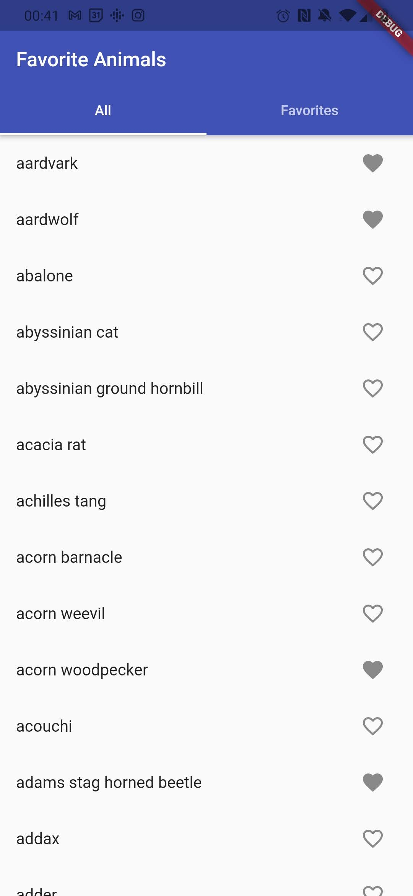
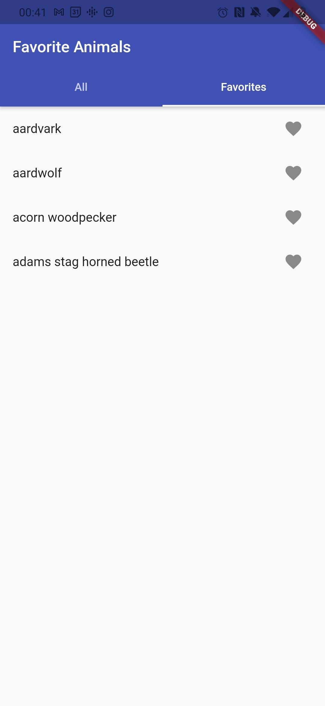

# Favorite Animals

In this tutorial, we'll create an app that presents you with a huge list of animals and lets you set several animals as favorites.

First, create a new project.
In the `pubspec.yaml` file, add `animal_names` and `chest_flutter` as dependencies:

```yaml
dependencies:
  animal_names: any
  chest_flutter: any
```

The `animal_names` package defines a variable called `all_animals` that is simply a huge list of over 1000 animal names.

This time, we'll use a global `Chest<Set<String>>` to store a set of all the animal names that the user favors.
If the app is started for the first time, we'll default to an empty set.

```dart
final favorites = Chest<Set<String>>('favorites', ifNew: () => {});
```

To use Chest with Flutter, call `initializeChest` in the `main` method.
To be able to store `String`s in the chest, we need to register the `tapers.forDartCore`.
Also, to be able to store a `Set<String>` in a type-safe way, we need to register a `taper.forSet<String>()`.
Otherwise, the set would be stored as a `Set<Object?>`, losing generic type information.
Tapers need to be registered under a type code.
It's recommended to start at `0` and go upwards from there.
Finally, we'll open the chest.

```dart
void main() async {
  await initializeChest();
  tape.register({
    ...tapers.forDartCore,
    0: taper.forSet<String>(),
  });
  await favorites.open();
  runApp(FavoriteAnimalsApp());
}
```

Before building the `FavoriteAnimalsApp` itself, we'll focus on just a single animal item.
Animals will be displayed in a `ListView`, so we'll use a `ListTile`.
Our `AnimalTile` just takes an animal name to display and will show a heart button at the end that is already interactive.

To achieve that, we can wrap the button in a `ReferenceBuilder`.
As a reference, we can pass in `favorites[animal]`.
You can't use brackets to index into normal sets, but when doing so on a `Reference<Set<String>>`, it returns a `Reference<void>` that can be watched and will notify you every time the value changes.
So, only if the favorite status of that particular animal changes, our icon button will rebuild.

The `Reference<Set<String>>` also has a `contains` method so we can check if our animal is included in the set without having to deserialize all favorites.
We can use the `contains` method to display either a filled heart or a heart with only a border.

Finally, `Reference<Set<String>>` has a `toggle` method that removes the given element if it's already in the set and adds it otherwise.
We can make use of that in the `IconButton`'s `onPressed` callback.

```dart
class AnimalTile extends StatelessWidget {
  const AnimalTile({Key key, @required this.animal}) : super(key: key);

  final String animal;

  @override
  Widget build(BuildContext context) {
    return ListTile(
      title: Text(animal),
      trailing: ReferenceBuilder(
        reference: favorites[animal],
        builder: (_) {
          return IconButton(
            icon: Icon(
              favorites.contains(animal)
                  ? Icons.favorite
                  : Icons.favorite_border,
            ),
            onPressed: () => favorites.toggle(animal),
          );
        },
      ),
    );
  }
}
```

Our main app screen will offer two tabs: One showing all animals and one only showing our favorites.
The typical way of implementing tabs is to wrap the whole app in a `DefaultTabController` and then use the `TabBarView` as the body, so that's what we'll do:

```dart
class FavoriteAnimalsApp extends StatelessWidget {
  @override
  Widget build(BuildContext context) {
    return DefaultTabController(
      length: 2,
      child: MaterialApp(
        title: 'Favorite Animals',
        theme: ThemeData(primarySwatch: Colors.indigo),
        home: Scaffold(
          appBar: AppBar(
            title: Text('Favorite Animals'),
            bottom: TabBar(
              tabs: [
                Tab(text: 'All'),
                Tab(text: 'Favorites'),
              ],
            ),
          ),
          body: TabBarView(
            children: [
              // First tab
              // Second tab
            ],
          ),
        ),
      ),
    );
  }
}
```

For the first tab, we can simply use a `ListView.builder` showing `AnimalTile`s for all animals.
The `AnimalTile`s will themselves take care about updating the set of favorites.

```dart
ListView.builder(
  itemCount: all_animals.length,
  itemBuilder: (context, index) =>
      AnimalTile(animal: all_animals[index]),
)
```

For the second tab, the whole list of animals should also update if any animal is added or removed from the favorites.
So, we'll simply wrap the whole second list into a `ReferenceBuilder`, rebuilding on changes to any of the `favorites`.
To get a deterministic order of animals, we'll convert the set into a `List` and `sort` that.
This is okay, because the list of favorites is usally quite small.

```dart
ReferenceBuilder(
  reference: favorites,
  builder: (_) {
    return ListView(
      children: [
        for (final animal in favorites.value.toList()..sort())
          AnimalTile(animal: animal),
      ],
    );
  },
)
```

And that's it!
We implemented an app with two pages that can act on the same data and it was *easy*.
Hearting the `bubblefish` in the huge list will automatically cause it to show in the second one and unhearting it there will also remove the heart from the first one.
That's how easy state management can be with chest.



